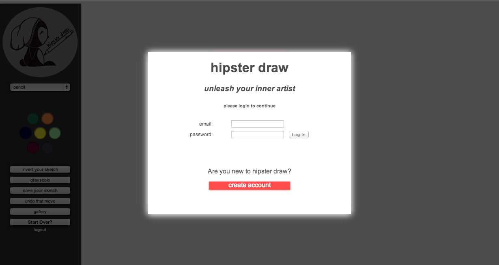
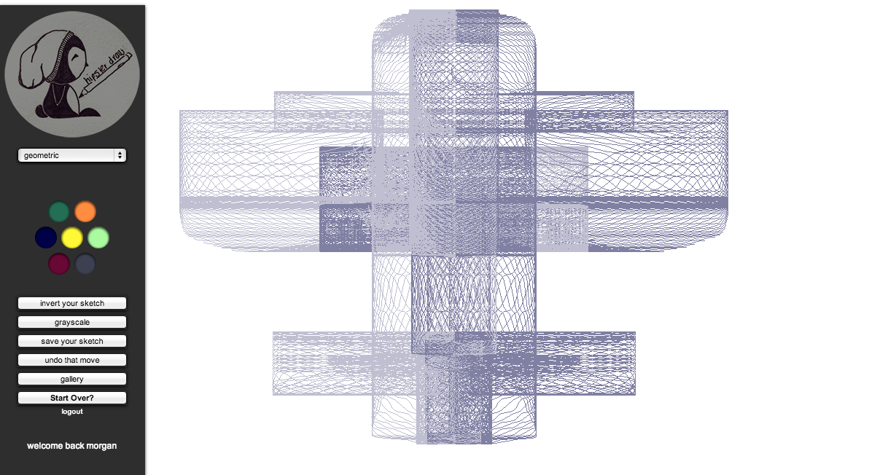
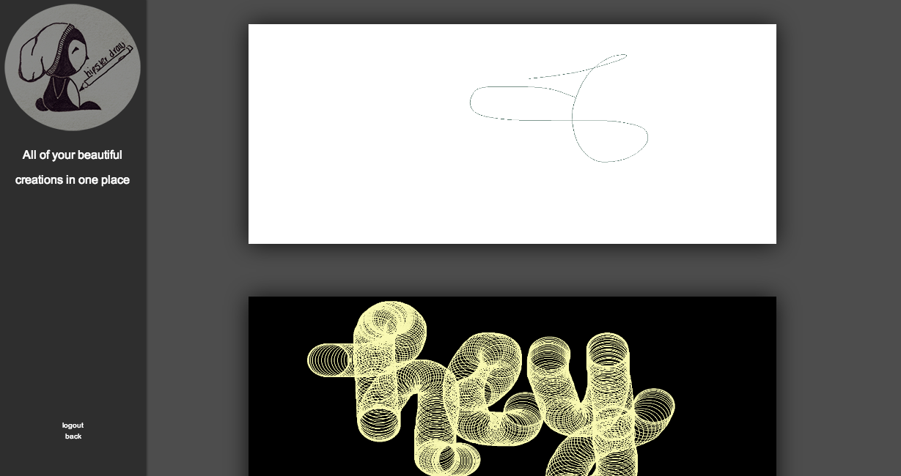

Hipster Draw
============

Hipster Draw is a sketching web application. It will track your movements on screen and draw in a manner that is consistent with your selections from the menu: color and brush choice, and effects such as color inversion and grayscale.

Hipster Draw uses Javascript, Jquery, Html, CSS, Python, Postgresql, Sqlalchemy, WTforms, Flask, Base64, and Bcrypt.

Screenshots
-----------

